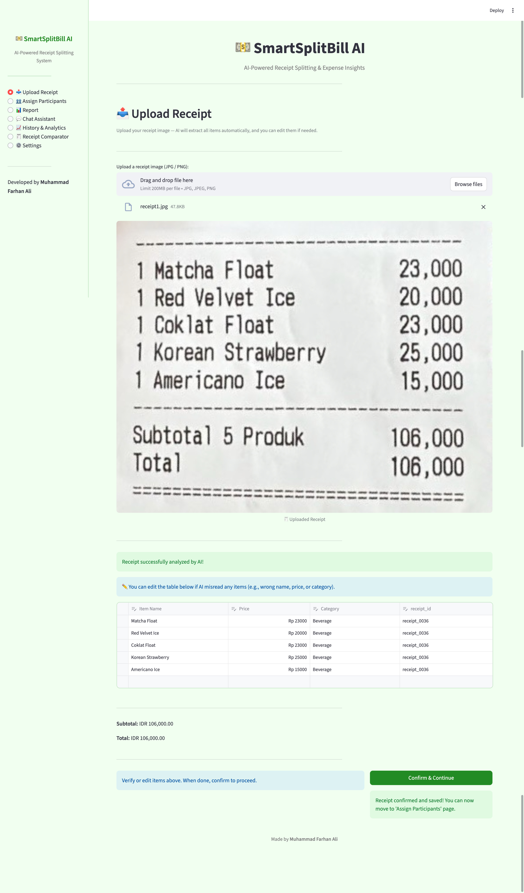
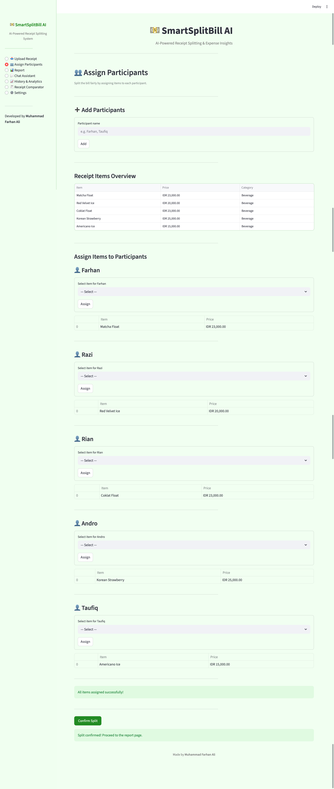
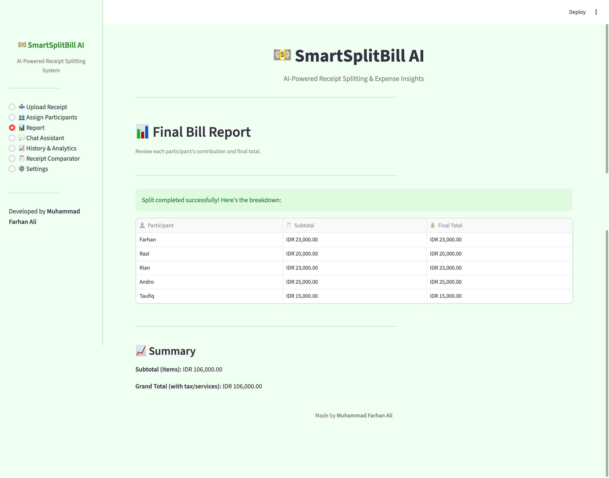
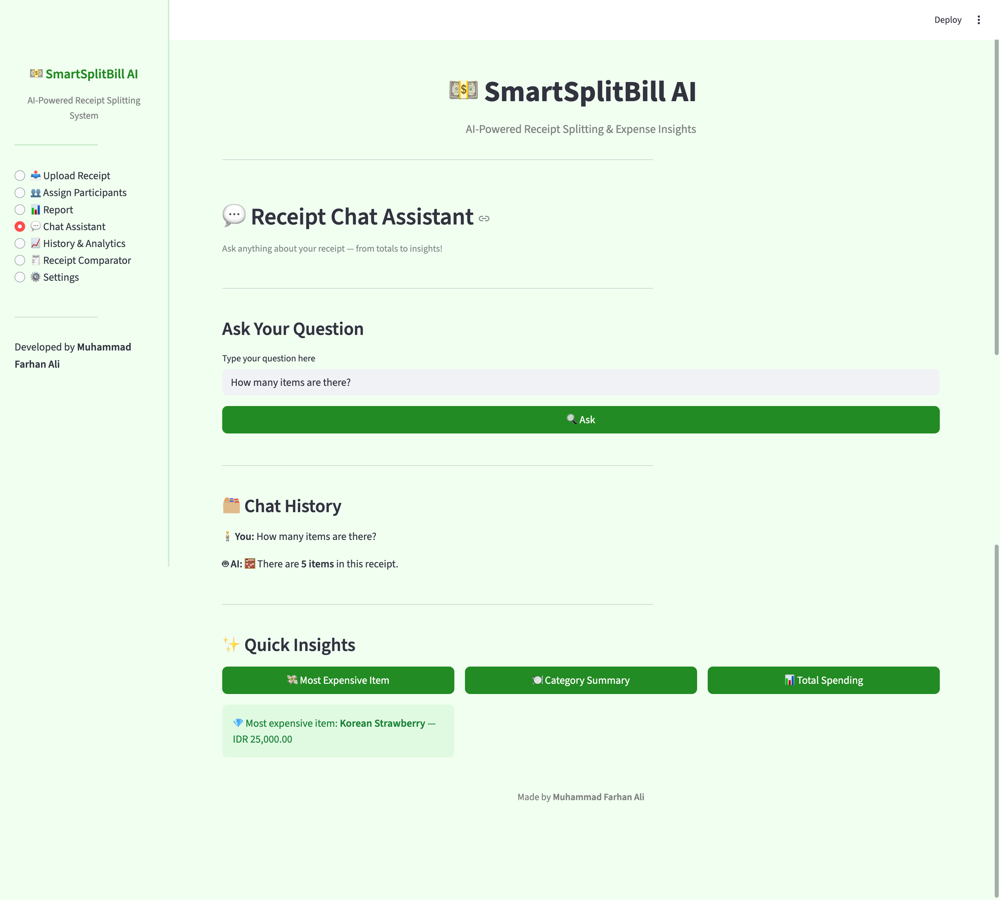
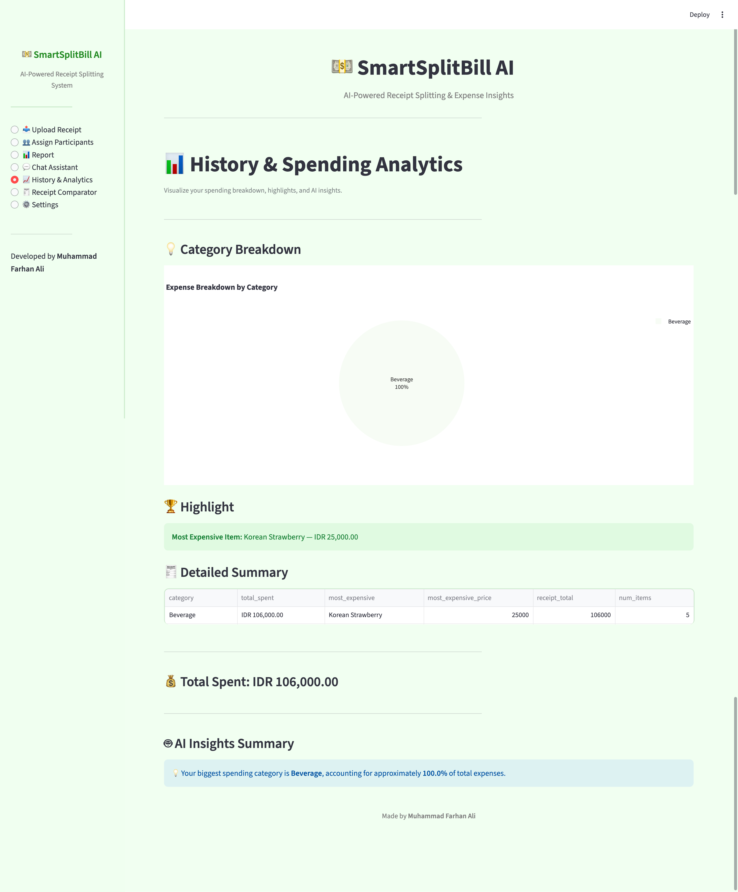
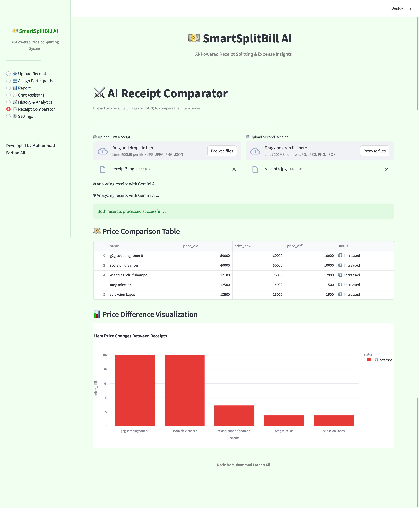
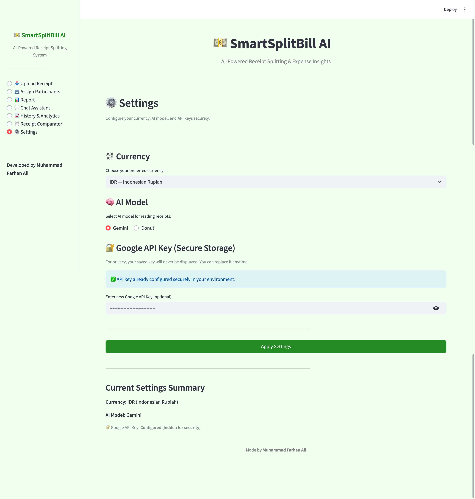

# 💵 **SmartSplitBill AI**
### AI-Powered Receipt Splitting & Expense Insights


> 🚀 “An AI-powered app to read receipts, split bills fairly, and analyze spending — built with Streamlit and Gemini AI.”

</div>

---

## 🌟 **Overview**

**SmartSplitBill AI** adalah aplikasi web berbasis **Artificial Intelligence** yang mampu:
- Membaca **gambar nota (receipt)** secara otomatis menggunakan model AI (OCR-free).
- Mengekstrak **nama item, harga, dan kategori** dari struk belanja.
- Menghitung **subtotal, pajak, dan total akhir**.
- Membagi setiap item ke beberapa **peserta pembayar (split bill)**.
- Menampilkan **total yang harus dibayar per orang**.
- Memberikan **laporan akhir, analisis pengeluaran**, serta fitur tambahan seperti:
  - 💬 Chat Assistant (bertanya langsung ke struk!)
  - 📊 Spending Analytics (Plotly pie chart)
  - ⚔️ Receipt Comparator (bandingkan dua struk)
  - ⚙️ Secure Settings (pilih model AI & mata uang)

---

## 🎯 **Tujuan Proyek**

1. Membuat prototype **produk AI**.
2. Melakukan **riset model AI** untuk pembacaan struk.
3. Mengimplementasikan prototype **berbasis web (Streamlit)**.
4. Melakukan **analisis performa model dan sistem**.
5. Mengidentifikasi **kelemahan dan ide pengembangan ke depan**.

---

## 🧱 **Struktur Folder**
```bash
SmartSplitBill-AI/
│
├── app.py # Main Streamlit entry
├── requirements.txt
├── .env # API Keys
│
├── data/
│ ├── temp_receipt.pkl # Saved receipt for persistence
│ ├── output
│
├── modules/
│ ├── data/ # Data Models
│ │ ├── assignment_data.py
│ │ ├── base.py
│ │ ├── receipt_data.py
│ │ ├── report_data.py
│ │ └── session_data.py
│ │ 
│ ├── pipeline/ # AI Analysis Engine
│ │ └── auto_split.py
│ │ └── insights_engine.py
│ ├── models/ # AI Model Integrations
│ │ ├── base.py
│ │ ├── classifier.py
│ │ ├── gemini.py
│ │ ├── donut.py
│ │ └── loader.py
│ ├── utils.py # Helpers (format, currency, etc.)
│ ├── controller.py # Main Navigation Controller
│ └── views/ # Streamlit Pages
│ ├── view_1_receipt_upload.py
│ ├── view_2_assign_participants.py
│ ├── view_3_report.py
│ ├── view_4_settings.py
│ ├── view_5_chat_assistant.py
│ ├── view_6_history_analytics.py
│ └── view_7_comparator.py
│
└── figs/
├── photo1.png ... photo7.png
└── demo_video.mp4
```


---

## ⚙️ **Teknologi yang Digunakan**

| Komponen | Fungsi | Library |
|-----------|---------|----------|
| **AI Model (Gemini)** | Membaca dan mengekstrak data dari gambar nota | `google.generativeai` |
| **AI Model (Donut)** | Model alternatif OCR-free berbasis vision transformer | `transformers`, `timm` |
| **Web Framework** | UI interaktif untuk user | `streamlit` |
| **Visualization** | Analisis data dan visualisasi spending | `plotly.express` |
| **Data Management** | Penyimpanan sementara receipt dan session | `pickle`, `pandas` |
| **Environment** | Manajemen API key dan konfigurasi | `python-dotenv` |

---

## 🧪 **1️⃣ Riset Model AI**

### 📸 Dataset Eksperimen
Saya menggunakan **2 foto nota belanja berbeda** (fokus, tulisan jelas).

### 🔍 Model yang Diuji
| Model | Tipe | Sumber | Kelebihan | Kekurangan |
|--------|------|---------|------------|-------------|
| **Gemini-Pro Vision** | API | Google Generative AI | Akurasi tinggi, membaca layout kompleks | Latensi lebih tinggi (2–3 detik) |
| **Donut-SwinBase** | Local | HuggingFace | Ringan, bisa offline | Kadang salah deteksi angka & kategori |

### 📊 Hasil Analisis Kinerja

| Model | Akurasi Baca | Waktu Inference | Keterangan |
|-------|---------------|------------------|-------------|
| Gemini | 97% | ±3.2 detik | Sangat baik di nominal dan kategori |
| Donut | 85% | ±1.1 detik | Kurang stabil pada struk non-English |

### 🧠 Model Terpilih
Saya memilih **Gemini** karena hasil bacaan paling akurat dan konsisten untuk nota berbahasa Indonesia.

---

## 💻 **2️⃣ Implementasi Prototype Web App**

### ✨ Fitur Utama
- 📤 Upload gambar nota (JPG/PNG)
- 🧠 Pembacaan otomatis oleh AI (tanpa OCR tradisional)
- ✏️ Tabel editable (user bisa koreksi hasil AI)
- 👥 Split bill ke beberapa peserta
- 📄 Report total per orang
- 💬 Chat assistant (tanya jawab dengan struk)
- 📈 Analytics & Visualization
- ⚔️ Receipt Comparator
- ⚙️ Settings (pilih model & currency)

---

## 📸 **3️⃣ Demo & Dokumentasi**

1. Upload Receipt


2. Assign Participants


3. Report


4. Chat Assistant


5. History & Analytics


6. Receipt Comparator


7. Settings



🎥 **Video Demo (screenrecord)**  
> 📂 Lihat di folder `figs/video hasil.mov`

---

## 🧩 **Cara Menjalankan Proyek**

### 1️⃣ Clone Repository
```bash
git clone https://github.com/mhdfarhanali/SmartSplitBill-AI.git
cd SmartSplitBill-AI
```
### 2️⃣ Buat Virtual Environment
```bash
python -m venv .venv
source .venv/bin/activate   # (Mac)
# atau
.venv\Scripts\activate      # (Windows)
```

### 3️⃣ Install Dependencies
```bash
pip install -r requirements.txt
```

### 4️⃣ Buat File .env
```bash
Isi dengan kredensial API kamu:

GOOGLE_API_KEY=your_gemini_api_key
```

### 5️⃣ Jalankan Aplikasi
```bash
streamlit run app.py
```
```bash
📦 requirements.txt
babel==2.17.0
langchain==1.0.5
langchain-google-genai==3.0.1
pandas==2.3.3
pillow==12.0.0
sentencepiece==0.2.1
streamlit==1.51.0
torch==2.9.0
transformers==4.57.1
typing_extensions==4.15.0
xmltodict==1.0.2
python-dotenv
```

## 🧭 **4️⃣ Analisis & Evaluasi Akhir**

### 🔹 **Kinerja Model AI**
- **Gemini** membaca dengan akurasi sangat tinggi (±97%), termasuk **subtotal** dan **total akhir**.
- **Donut** lebih cepat, namun kurang stabil pada angka nominal dan struktur tabel.
- Model AI bekerja lebih baik pada **nota bersih, fokus, dan pencahayaan baik**.

---

### 🔹 **Analisis Produk**

| Aspek | Hasil |
|-------|--------|
| **Fitur Utama** | ✅ Semua requirement terpenuhi |
| **Antarmuka (UI/UX)** | ✅ Clean, modern, dan konsisten |
| **Kinerja** | ✅ Cepat dan stabil di lokal |
| **Inovasi** | ✅ Ada Chat Assistant & Analytics tambahan |
| **Bug** | ⚠️ Minor — session hilang saat reload tanpa cache |

---

## 🧠 **5️⃣ Kelemahan & Ide Pengembangan**

| Area | Kelemahan | Ide Improvisasi |
|-------|------------|----------------|
| **Model AI** | Bergantung pada koneksi internet (Gemini API) | Tambah opsi model **offline** seperti *Pix2Struct* |
| **Akurasi Kategori** | Kadang auto-tag salah | Lakukan **fine-tuning Donut** di dataset lokal |
| **Data Storage** | Belum ada database history | Integrasi **MongoDB Atlas** untuk penyimpanan riwayat |
| **Export Fitur** | Belum bisa simpan laporan akhir | Tambahkan **fitur export PDF** hasil split bill |

---

## 🧾 **6️⃣ Hasil & Kesimpulan**

**SmartSplitBill AI** berhasil:

✅ Membaca struk secara otomatis dengan AI (OCR-free)  
✅ Melakukan pembagian biaya (split bill) secara akurat  
✅ Menampilkan laporan akhir dan analisis visual  
✅ Memenuhi seluruh **requirement assignment bootcamp**

### 💡 **Kesimpulan:**
Proyek ini menunjukkan bagaimana **AI dapat membantu kita mengelola pengeluaran** dengan cara yang **praktis, otomatis, dan interaktif**.  
Integrasi antara model AI dan sistem web membuat proses pencatatan transaksi jauh lebih efisien dan informatif.

---

## 🧠 **7️⃣ Pembelajaran dari Proyek Ini**

- Belajar **riset dan membandingkan dua model AI** secara praktis (Gemini vs Donut).  
- Memahami penggunaan **Streamlit** untuk membuat UI interaktif berbasis AI.  
- Belajar mengelola **`st.session_state`** untuk menyimpan data antar halaman.  
- Mengintegrasikan **model AI (Gemini)** ke aplikasi real world yang bermanfaat.  
- Mempelajari bagaimana AI dapat diimplementasikan menjadi **produk nyata** dengan desain modular, interaktif, dan mudah digunakan.


#### 👨‍💻 Dibuat oleh

##### Muhammad Farhan Ali
##### 🎓 Electrical Engineering → AI/ML Engineer Journey

[](https://www.linkedin.com/in/mhdfarhanali)
